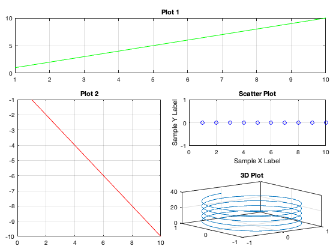

# HarryPlotter.m
A simple plotting library for MATLAB to minimize wasted white space around multiple plots on the same figure. 

## Usage
With the HarryPlotter.m class added to your path, simply call the constructor to create a new figure:

```
f1 = HarryPlotter("Example Data", 3, 2);
f2 = HarryPlotter(3, 2);
f3 = HarryPlotter("Figure with 1 Row and 1 Column");
f4 = HarryPlotter();
```

In the first line, the first argument provides a name to the figure. The following arguments specify the number of rows and columns into which the figure is divided. Different ways of calling the constructor are also illustrated. If the number of rows and columns are not provided, they default to one each. 

Similar to the `subplot` function in MATLAB, HarryPlotter allows multiple plots to be added to the same figure. Additionally, these figures can span multiple grids defined by the number of rows and columns in the figure.

```
f1.subplot(1, 1, 1, 2);
plot(1:10, 'g');
title('Plot 1');

f1.subplot(2, 1, 2, 1);
plot(-1:-1:-10, 'r');
title('Plot 2');

f1.subplot();
scatter(1:10, zeros(1,10), 'b');
title('Scatter Plot');
xlabel('Sample X Label');
ylabel('Sample Y Label');

f1.subplot(3,2);
plot3(sin(0:pi/50:10*pi), cos(0:pi/50:10*pi), 0:pi/50:10*pi);
title('3D Plot');

f1.update();
```

Note that all the plots are placed adjacent to each other with a default padding of 10 pixels. This spacing can be configured by modifying the `padding` property of the class instance. 

The `.subplot` member function creates an axes spanning the desired number of rows and columns, and sets the axes as the current target for subsequent plotting functions. When four arguments are specified, as in `f1.subplot(2, 1, 2, 1);`, the first two arguments specifiy the row and column, respectively, to begin the axes. The next two arguments specify the height and width of the axes. When the two arguments are omitted, as in `f1.subplot(3,2);`, the height and width both default to 1. When no arguments are passed in, the axes are created at the next available spot in the figure. 

Note that the `.update()` function should be called to redraw the plots and apply all the changes. When the figure window is resized, this function is automatically called. 



